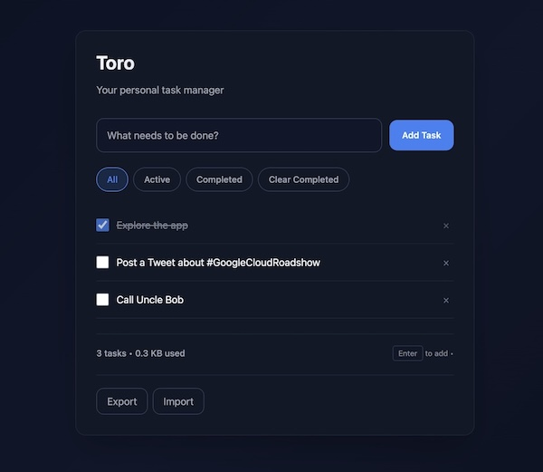
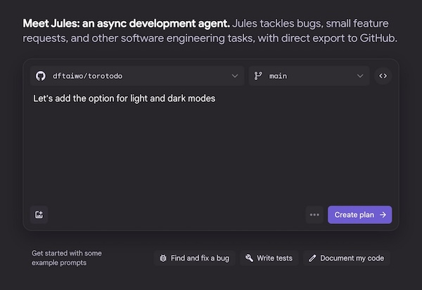
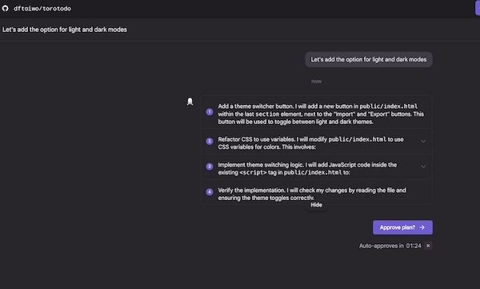

# Workshop: From Feature Request to Pull Request
## Automating the Developer Workflow with Jules & GitHub

<div align="center">


</div>

---

##  Workshop Overview

| **Level** | **Duration** | **Prerequisites** |
|-----------|--------------|-------------------|
| All Levels | ~35 minutes | GitHub Account, Browser, Code Editor |

###  What You'll Build
A browser-only Todo app (HTML/CSS/JS), then use an autonomous Jules  to implement features and fix bugs via GitHub PRs.


###  What You'll Learn
-  How to structure issues & acceptance criteria for agentic work
-  How to connect a repo, start a task, review diffs, and merge PRs  
-  Patterns for small, safe, automatable changes
-  Best practices for AI-assisted development workflows

---

##  Prerequisites

### Required
- [ ] **GitHub Account** - GitHub (https://github.com/)
- [ ] **Web Browser** - Chrome, Firefox, Safari, or Edge
- [ ] **Code Editor** - VS Code, or any editor for quick reviews

### Optional (for stretch goals)
- [ ] **Google Cloud Project** - For Firebase Hosting
- [ ] **Node.js** - For Firebase CLI tools

>  **Pro Tips:** 
1. Have your GitHub account ready and logged in before we start.
2. (Optional) Activate the Google Cloud Credits  for the last part of this workshop
---

## Step 1: Get the Starter App

###  Repository
Visit: **[https://github.com/dftaiwo/torotodo](https://github.com/dftaiwo/torotodo)**

###  Choose Your Setup Method

<details>
<summary><strong>Option A (Recommended):  Fork the Repo (Recommended - 30 seconds)</strong></summary>

1. **Fork the repository**
   - Click the "Fork" button on the repository page
   - Or visit: [https://github.com/dftaiwo/torotodo/fork](https://github.com/dftaiwo/torotodo/fork)
   - Leave all defaults and click "Create Fork"

2. **Verify it works**
   - Open your forked repo
   - Navigate to `public/index.html`
   - Click "Raw" and open in a new tab to test

</details>

<details>
<summary><strong>Option B: Create Your Own Repo (2-3 minutes)</strong></summary>

1. **Create a new repository**
   - Go to GitHub and create a new repo (public or private)
   - Name it `torotodo` or similar

2. **Add the starter code**
   - Download the zip from the main repo
   - Extract `public/index.html`
   - Upload to your new repo and commit to `main`

3. **Test locally**
   - Open `public/index.html` in your browser to confirm it works

</details>

>  **Verification:** Your Todo app should load and allow you to add/complete tasks

---

##  Step 2: Connect Your Repo to Jules

### Initial Setup

1. **Visit Jules**
   - Go to **[jules.google](https://jules.google)** 
   - Click "Try Jules"

2. **Authorize GitHub Access**
   - Grant Jules access to your GitHub account
   - Select your new `torotodo` repository
   
3. **Enable GitHub App** (for issue-triggered tasks)
   - Ensure the Jules GitHub app is authorized for your repo
   - This allows Jules to create PRs automatically from labeled issues

---

##  Step 3: Your First AI Task

### 🌓 Let's Add Dark Mode!

1. **Open Jules Dashboard**
   - Go to **[jules.google](https://jules.google)**
   - Click "Try Jules"

2. **Select Your Repository**
   - Ensure your `torotodo` repo is selected in the dropdown

3. **Create Your First Task**
   ```
   Let's add the option for light and dark modes
   ```



4. **Generate the Plan**
   - Click **"Create Plan"**
   - **Wait time:** Initial bootup takes ~2 minutes

5. **Review & Approve**
   - Review Jules' proposed plan
   - If satisfied: Click **"Approve Plan"**
   - If not: Provide feedback and ask for revisions



>  **Note:** The initial setup may take 1-2 minutes as Jules provisions your workspace

Jules will start and may run for as little as 3 minutes or up to 10 minutes.


###  When Jules is Done

1. **Pull the Changes in VS Code**
   - Open the Source Control view (Ctrl+Shift+G or Command+Shift+G)
   - Click the three dots (...) menu
   - Select "Pull from..." and choose `origin/jules/dark-mode` or whatever name was shown by Jules
   
2. **Switch to Jules' Branch**
   - In VS Code's status bar, click the branch name
   - Select the new branch from the dropdown
   
3. **Test in Your Browser**
   - Open `index.html` in your browser
   - Verify the dark mode toggle appears
   - Test switching between light/dark modes
   - Confirm the preference persists after refresh
   - Check that all UI elements are properly styled in both modes

4. **Review & Merge**
   - If everything looks good, merge using either:
     - **GitHub UI**: Go to the PR and click the "Merge" button
     - **VS Code**: Use the GitHub Pull Requests extension
       - Open the GitHub tab in VS Code
       - Find the PR under "Pull Requests"
       - Click "Merge Pull Request"
   - After merging, in VS Code:
     - Switch to main: Click branch name → select 'main'
     - Pull changes: Click ↻ in status bar or use Command Palette

> ✅ **Success Check:** The app should now support both light and dark modes, with proper persistence and smooth transitions


---
##  Step 4: CSV Export Feature

###  We'll implement this together!

**Task:** Add CSV export functionality to the Todo app

Create a New Task by clicking on the "+" sign 

### The Prompt

Copy and paste this into Jules:

```markdown
Implement "Export CSV" in index.html for the app.
Requirements:
- Add an "Export CSV" button beside Export JSON.
- CSV headers: id,title,completed,createdAt,dueAt
- Escape commas/quotes; UTF-8; downloadable filename todos.csv
- Keep code minimal and idiomatic; do not break existing features.
Provide tests/checks or clear manual validation notes.
```

###  The Workflow

1. **Start the Task**
   - Jules analyzes, plans, and opens a PR
   - Runs in secure cloud VMs with direct GitHub integration

2. **Review Phase**
   - Read Jules' plan
   - Inspect the code diff
   - Test the branch locally (optional)

3. **Validation**
   - Click the new **Export CSV** button
   - Verify headers and data escaping
   - Check file download works

4. **Merge Decision**
   - Merge if it meets acceptance criteria
   - Request changes if needed

>  Watch Jules work in real-time - it's like having a coding pair partner.

---

##  Step 5: Create Agent-Friendly Issues

### What Makes a Good Issue?

Issues can be:
-  **Bug reports** - Something that's broken
-  **Feature requests** - New functionality  
-  **Documentation** - Improvements to docs
-  **Refactoring** - Code improvements

###  Let's Create Three Issues

We'll create these issues and run at least two live during the workshop.

<details>
<summary><strong> How to Create a GitHub Issue</strong></summary>

1. **Navigate to Issues**
   - Click the "Issues" tab in your GitHub repository

2. **Create New Issue**
   - Click the green "New Issue" button

3. **Fill in Details**
   - Enter a descriptive title
   - Add relevant details in the description
   - Click "Submit new issue"

</details>


### Issue A: Due Date & Sorting

**Title:** `feat: Add due date & sorting`

**Description:**
```
Add an optional `dueAt` (date) per todo. Show due date in the list. Add a sort toggle: **Created | Due Date | Completed**.

**Acceptance Criteria:**
- Backward compatible with existing saved data
- Sort persists during the session  
- No breaking changes to existing features
```

---

###  Issue B: Inline Edit Bug

**Title:** `bug: Inline edit does not work`

**Description:**
```
When double-clicking to edit, instead it marks the todo item as completed.

**Acceptance Criteria:**
- Double-clicking a todo item opens the inline editor
- Editing and pressing Enter saves changes
- Editing and pressing Escape cancels
- Clicking outside cancels edit mode
- Changes persist after page reload
```

---

###  Issue C: Search & Overdue Filter

**Title:** `feat: Search & "Overdue" filter`

**Description:**
```
Add a text search that filters by title (debounced). Add a quick filter **Overdue** = `dueAt < today && !completed`.

**Acceptance Criteria:**
- Search works with active/completed filters
- Overdue filter combines with search predictably
```

---

###  Trigger Jules with Labels

> Add the `jules` label to any issue to automatically trigger Jules to work on it.

<details>
<summary><strong> How to Add a Label to an Issue</strong></summary>

1. **Open the Issue**
   - Navigate to the issue you want to label in GitHub

2. **Add the Label**
   - On the right sidebar, click the gear icon next to "Labels"
   - Select the `jules` label from the dropdown
   - Or type `jules` to create it if it doesn't exist

3. **Watch the Magic**
   - The label is immediately applied
   - Within seconds, Jules picks up the task
   - Jules will create a PR once the work is complete

</details>

> **Live Demo:** We'll label one of these issues and watch Jules work in real-time!

---

##  Step 6: Review Gates & Best Practices

###  Quality Control Framework

While Jules works, here are the **review gates** we follow:

####  **Pre-Work Review**
- [ ] **Clear acceptance criteria** in the issue
- [ ] **Small, focused scope** - one feature per issue
- [ ] **Well-defined requirements** - no ambiguity

####  **During Development**
- [ ] **Small, incremental diffs** - easy to review
- [ ] **Manual validation steps** provided
- [ ] **No breaking changes** to existing features

####  **Post-Work Validation**
- [ ] **Review** → **Validate** → **Merge**
- [ ] Test the feature manually
- [ ] Verify acceptance criteria are met

### The Mental Model

> **"Jules as a intermediate teammate"**
> 
> - **Engineers:** Author good issues and reviews
> - **Agent:** Does focused coding
> - **Together:** Build better software faster

Jules is a perpetually available  pair programmer
---

##  Step 7: Key Takeaways & Patterns

###  **What Worked Well**

- **Small scope** → Fast, focused PRs
- **Explicit acceptance criteria** → Clear success metrics  
- **Single-file app** → Simple to review and test
- **Incremental changes** → Easy to validate

###  **When to Use Jules **

**Great for:**
-  **Repetitive chores** - Boilerplate code, data migrations
-  **Clear, small features** - UI components, utility functions
-  **UI glue code** - Event handlers, form validation
-  **Data I/O** - CSV/JSON export/import, API integrations
-  **Small bug fixes** - Logic errors, edge cases
-  **Test gaps** - Unit tests, integration tests

### **When NOT to Use Jules or AI Agents Generally**

**Avoid for:**
- **Ambiguous requirements** - Need human clarification
- **Large refactors** - Complex architectural changes
- **Security-sensitive code** - Without strong guardrails
- **Business logic** - Domain-specific algorithms
- **Creative design** - UX/UI decisions

---

## Step 8: Stretch Goals - Auto Deployment

### Firebase Hosting + GitHub Actions

*Time permitting - let's add automatic deployment!*

### Setup Steps

#### 1. **Install Firebase CLI**
```bash
npm install -g firebase-tools
```
> Or visit: [Firebase CLI Documentation](https://firebase.google.com/docs/cli)

#### 2. **Login to Firebase**
```bash
firebase login
```

#### 3. **Initialize Firebase Hosting**
```bash
firebase init hosting
```
**Configuration:**
- ✅ Select "Create a new project" or use existing
- ✅ Set public directory as `public`
- ❌ Configure as single-page app: **No**
- ❌ Don't overwrite index.html

#### 4. **Setup GitHub Actions**
```bash
firebase init hosting:github
```
-  Accept default file locations
-  Creates `.github/workflows/firebase-hosting-merge.yml`

#### 5. **Deploy!**
Commit the changes to the repo using your IDE or cmdline
```bash
git add .
git commit -m "Add Firebase hosting and GitHub Actions"
git push
```

###  **The Magic Happens**

Now whenever you push to `main`:
-  **GitHub Action triggers** automatically
-  **Builds and deploys** to Firebase Hosting  
-  **Live at:** `https://[YOUR-PROJECT].web.app`

>  **Monitor:** Check deployment status in GitHub Actions tab


###  **Resources & Links**

-  **Getting Started:** [jules.google/docs](https://jules.google/docs)
-  **Managing Tasks:** [jules.google/docs/tasks-repos](https://jules.google/docs/tasks-repos)
-  **Running Tasks:** [jules.google/docs/running-tasks](https://jules.google/docs/running-tasks)
-  **Awesome Jules Prompts:** [github.com/google-labs-code/jules-awesome-list](https://github.com/google-labs-code/jules-awesome-list)

---

##  Quick Reference Handout

### **Great Prompt Template**

```markdown
You are contributing to a ----------.

**Goal:** <one-sentence outcome>

**Constraints:**
- Keep the code minimal and idiomatic
- Preserve existing behavior and keyboard shortcuts  
- Add comments where non-obvious

**Acceptance:**
- <bullet list of precise checks>

**Deliverable:** Produce a concise PR with a clear description and manual validation steps
```

### ✅ **Issue Checklist**

- [ ] **Clear title** prefixed with `feat:` / `bug:` / `chore:`
- [ ] **One tight scope** per issue
- [ ] **Acceptance criteria** (observable, testable)
- [ ] **Label `jules`** if using issue-trigger flow

---

<div align="center">

## **Thank You for Participating!**

**Happy Coding with Jules!** 

---

*Workshop created by [@dftaiwo](https://x.com/dftaiwo)*

</div>
